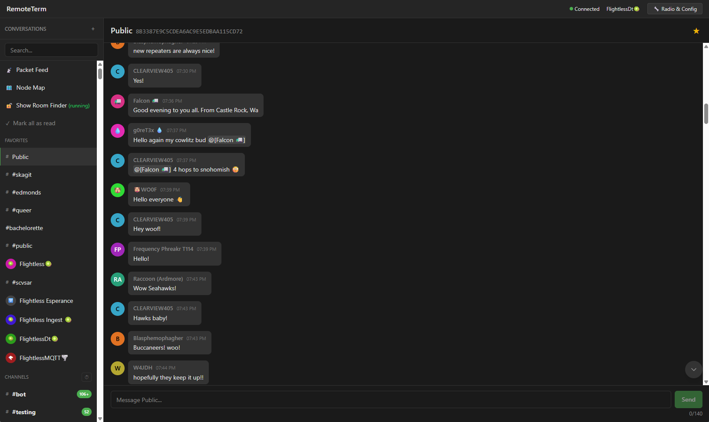

# Remote Terminal for MeshCore 🐨

A high-performance, web-based terminal and API gateway for MeshCore, optimized for **Proxmox LXC infrastructure**. This fork enables real-time mesh monitoring, remote command execution, and deep integration with **Home Assistant** via MQTT, as well as the messaging


## Key Features
* **Web-Based Console:** Full interactive terminal for radio configuration and monitoring.
* **REST API:** Send messages, manage contacts, and check radio health programmatically.
* **LXC Optimized:** High-performance deployment using unprivileged containers and direct `dev0` mapping.
* **MQTT Gateway:** Bridge your mesh traffic to Home Assistant (RSSI, SNR, and Text).

## Future Enhancements being investigated.
* **Observer**
* **MeshCLI**
* **Fleet Management**
* **Deeper Home Assistant Integration** Featuring alerts, status etc to a nominated channel.
---

# 🛠 Installation: Proxmox LXC Deployment

### 1. LXC Container Requirements
* **Template:** Debian 12 (Bookworm) or Ubuntu 24.04.
* **Mode:** **Unprivileged** (Recommended for security).
* **Resources:** 1GB RAM (for build), 1 CPU Core, 4GB Disk.
* **Hardware:** Meshtastic-compatible radio (e.g., RAK4631) connected via USB to the host.

### 2. Hardware Passthrough (Proxmox Host)
Map the USB serial device from the host into the container using the `devX` method. This handles permissions automatically without needing privileged mode.

1.  **Identify device on Host:** `ls -l /dev/serial/by-id/`
2.  **Edit LXC Config:** `nano /etc/pve/lxc/ID.conf`
3.  **Add device line:** `dev0: /dev/ttyACM0` (Update path if your device is `ttyUSB0`)

### 3. Environment & Dependencies
Log into your LXC as `root`. We install **Node.js 20 (LTS)** for frontend compatibility.

1.  **Install Node.js 20 (LTS) & System Tools:**
    ```bash
    apt update && apt install -y ca-certificates curl gnupg
    curl -fsSL [https://deb.nodesource.com/setup_20.x](https://deb.nodesource.com/setup_20.x) | bash -
    apt install -y nodejs git python3-pip
    ```
2.  **Install `uv` (Python Manager):**
    ```bash
    curl -LsSf [https://astral.sh/uv/install.sh](https://astral.sh/uv/install.sh) | sh
    source $HOME/.cargo/env
    ```

### 4. Build the Frontend
To match the pre-configured service paths, we will install the application in `/opt/remoteterm`.

```bash
mkdir -p /opt/remoteterm
git clone [https://github.com/dan-dan81/Remote-Terminal-for-MeshCore.git](https://github.com/dan-dan81/Remote-Terminal-for-MeshCore.git) /opt/remoteterm
cd /opt/remoteterm/frontend

# Install node modules and build
npm install
npm run build
npm run dev      # Dev server at http://localhost:5173 (proxies API to :8000)

### 5. Setup Python Backend & Database
'''bash
cd /opt/remoteterm
uv sync

# Create the data directory for the database
mkdir -p data

### 6. Activate Services
Use the pre-configured service files included in the repository.

Link Services:
'''Bash
# Copy to systemd and set permissions
cp /opt/remoteterm/remoteterm.service /etc/systemd/system/
chmod 644 /etc/systemd/system/remoteterm.service

Activate:
'''Bash
systemctl daemon-reload
systemctl enable --now remoteterm.service
systemctl status


📡 Additional Features: MQTT and Home Assistant Integration

1. Configure the MQTT Bridge
Define Variables in .env:

'''Bash
echo "MQTT_BROKER=192.168.86.135" >> /opt/remoteterm/.env
echo "MQTT_TOPIC=meshcore/terminal/rx" >> /opt/remoteterm/.env


Setup Bridge Service:
'''Bash
cp /opt/remoteterm/remoteterm-bridge.service /etc/systemd/system/
chmod 644 /etc/systemd/system/remoteterm-bridge.service
systemctl enable --now remoteterm-bridge.service

3. The Bridge Script (mqtt_bridge.py)
This is the "engine" that listens to the MeshCore WebSocket and pushes to MQTT. This is in the repo for publishing remoteterm/mqtt_bridge.py
'''python
import asyncio
import websockets
import json
import paho.mqtt.client as mqtt
import os
from dotenv import load_dotenv

load_dotenv()

# Config from .env
MQTT_BROKER = os.getenv("MQTT_BROKER", "localhost")
MQTT_TOPIC = os.getenv("MQTT_TOPIC", "meshcore/terminal/rx")
WS_URL = os.getenv("WS_URL", "ws://127.0.0.1:8000/api/ws")

def on_connect(client, userdata, flags, rc):
    print(f"Connected to MQTT Broker with result code {rc}")

mqtt_client = mqtt.Client()
mqtt_client.on_connect = on_connect
mqtt_client.connect(MQTT_BROKER, 1883, 60)
mqtt_client.loop_start()

async def bridge():
    while True:
        try:
            async with websockets.connect(WS_URL) as websocket:
                print(f"Connected to MeshCore WebSocket at {WS_URL}")
                while True:
                    message = await websocket.recv()
                    # Forward the raw JSON to MQTT
                    mqtt_client.publish(MQTT_TOPIC, message)
                    print(f"Forwarded: {message[:50]}...")
        except Exception as e:
            print(f"Connection lost, retrying in 5s... Error: {e}")
            await asyncio.sleep(5)

if __name__ == "__main__":
    asyncio.run(bridge())

4. Activation Steps
Once those files are in place, run these commands to go live:

'''Bash
# Copy and link the service
cp /opt/remoteterm/remoteterm-bridge.service /etc/systemd/system/
# Set permissions
chmod 644 /etc/systemd/system/remoteterm-bridge.service
# Reload and Start
systemctl daemon-reload
systemctl enable --now remoteterm-bridge.service


2. Home Assistant Configuration
Add the following to your configuration.yaml to monitor your mesh health and signal:

YAML
mqtt:
  sensor:
    - name: "Mesh Signal RSSI"
      state_topic: "meshcore/terminal/rx"
      unit_of_measurement: "dBm"
      value_template: "{{ value_json.data.rssi | default(states('sensor.mesh_signal_rssi')) }}"
      device_class: signal_strength

    - name: "MeshCore Radio Status"
      state_topic: "meshcore/terminal/rx"
      value_template: >
        
          {{ 'Online' if value_json.data.radio_connected else 'Offline' }}
        
          {{ states('sensor.meshcore_radio_status') }}
        


**Warning:** This app has no auth, and is for trusted environments only. _Do not put this on an untrusted network, or open it to the public._ The bots can execute arbitrary Python code which means anyone on your network can, too. If you need access control, consider using a reverse proxy like Nginx, or extending FastAPI.



## Disclaimer

This is entirely vibecoded slop -- no warranty of fitness for any purpose. It's been lovingly guided by an engineer with a passion for clean code and good tests, but it's still mostly LLM output, so you may find some bugs.

If extending, have your LLM read the three `AGENTS.md` files: `./AGENTS.md`, `./frontend/AGENTS.md`, and `./app/AGENTS.md`.


# Install backend dependencies
uv sync

# Build frontend
cd frontend && npm install && npm run build && cd ..

# Run server
uv run uvicorn app.main:app --host 0.0.0.0 --port 8000
```

The server auto-detects the serial port. To specify a transport manually:
```bash
# Serial (explicit port)
MESHCORE_SERIAL_PORT=/dev/ttyUSB0 uv run uvicorn app.main:app --host 0.0.0.0 --port 8000

# TCP (e.g. via wifi-enabled firmware)
MESHCORE_TCP_HOST=192.168.1.100 MESHCORE_TCP_PORT=4000 uv run uvicorn app.main:app --host 0.0.0.0 --port 8000

# BLE (address and PIN both required)
MESHCORE_BLE_ADDRESS=AA:BB:CC:DD:EE:FF MESHCORE_BLE_PIN=123456 uv run uvicorn app.main:app --host 0.0.0.0 --port 8000
```

Access at http://localhost:8000

> **Note:** WebGPU cracking requires HTTPS when not on localhost. See the HTTPS section under Additional Setup.


## Development

### Backend

```bash
uv sync
uv run uvicorn app.main:app --reload

# Or with explicit serial port
MESHCORE_SERIAL_PORT=/dev/ttyUSB0 uv run uvicorn app.main:app --reload
```

### Frontend

```bash
cd frontend
npm install
npm run dev      # Dev server at http://localhost:5173 (proxies API to :8000)
npm run build    # Production build to dist/
```

Run both the backend and `npm run dev` for hot-reloading frontend development.

### Code Quality & Tests

Please test, lint, format, and quality check your code before PRing or committing. At the least, run a lint + autoformat + pyright check on the bakend, and a lint + autoformat on the frontend.

<details>
<summary>But how?</summary>

```bash
# python
uv run ruff check app/ tests/ --fix  # lint + auto-fix
uv run ruff format app/ tests/       # format (always writes)
uv run pyright app/                  # type checking
PYTHONPATH=. uv run pytest tests/ -v # backend tests

# frontend
cd frontend
npm run lint:fix                     # esLint + auto-fix
npm run test:run                     # run tests
npm run format                       # prettier (always writes)
npm run build                        # build the frontend
```
</details>

## Configuration

| Variable | Default | Description |
|----------|---------|-------------|
| `MESHCORE_SERIAL_PORT` | (auto-detect) | Serial port path |
| `MESHCORE_SERIAL_BAUDRATE` | 115200 | Serial baud rate |
| `MESHCORE_TCP_HOST` | | TCP host (mutually exclusive with serial/BLE) |
| `MESHCORE_TCP_PORT` | 4000 | TCP port |
| `MESHCORE_BLE_ADDRESS` | | BLE device address (mutually exclusive with serial/TCP) |
| `MESHCORE_BLE_PIN` | | BLE PIN (required when BLE address is set) |
| `MESHCORE_LOG_LEVEL` | INFO | DEBUG, INFO, WARNING, ERROR |
| `MESHCORE_DATABASE_PATH` | data/meshcore.db | SQLite database path |
| `MESHCORE_MAX_RADIO_CONTACTS` | 200 | Max recent contacts to keep on radio for DM ACKs |

Only one transport may be active at a time. If multiple are set, the server will refuse to start.

## Additional Setup

<details>
<summary>HTTPS (Required for WebGPU Cracking outside localhost)</summary>

WebGPU requires a secure context. When not on `localhost`, serve over HTTPS:

```bash
openssl req -x509 -newkey rsa:4096 -keyout key.pem -out cert.pem -days 365 -nodes -subj '/CN=localhost'
uv run uvicorn app.main:app --host 0.0.0.0 --port 8000 --ssl-keyfile=key.pem --ssl-certfile=cert.pem
```

For Docker:

```bash
# generate TLS cert
openssl req -x509 -newkey rsa:4096 -keyout key.pem -out cert.pem -days 365 -nodes -subj '/CN=localhost'

# run with cert
docker run -d \
  --device=/dev/ttyUSB0 \
  -v remoteterm-data:/app/data \
  -v $(pwd)/cert.pem:/app/cert.pem:ro \
  -v $(pwd)/key.pem:/app/key.pem:ro \
  -p 8000:8000 \
  jkingsman/remote-terminal-for-meshcore:latest \
  uv run uvicorn app.main:app --host 0.0.0.0 --port 8000 --ssl-keyfile=/app/key.pem --ssl-certfile=/app/cert.pem
```

Accept the browser warning, or use [mkcert](https://github.com/FiloSottile/mkcert) for locally-trusted certs.
</details>

<details>
<summary>Systemd Service (Linux)</summary>

```bash
# Create service user
sudo useradd -r -m -s /bin/false remoteterm

# Install to /opt/remoteterm
sudo mkdir -p /opt/remoteterm
sudo cp -r . /opt/remoteterm/
sudo chown -R remoteterm:remoteterm /opt/remoteterm

# Install dependencies
cd /opt/remoteterm
sudo -u remoteterm uv venv
sudo -u remoteterm uv sync

# Build frontend (required for the backend to serve the web UI)
cd /opt/remoteterm/frontend
sudo -u remoteterm npm install
sudo -u remoteterm npm run build

# Install and start service
sudo cp /opt/remoteterm/remoteterm.service /etc/systemd/system/
sudo systemctl daemon-reload
sudo systemctl enable --now remoteterm

# Check status
sudo systemctl status remoteterm
sudo journalctl -u remoteterm -f
```

Edit `/etc/systemd/system/remoteterm.service` to set `MESHCORE_SERIAL_PORT` if needed.
</details>

<details>
<summary>Testing</summary>

**Backend:**
```bash
PYTHONPATH=. uv run pytest tests/ -v
```

**Frontend:**
```bash
cd frontend
npm run test:run
```
</details>

## API Documentation

With the backend running: http://localhost:8000/docs
